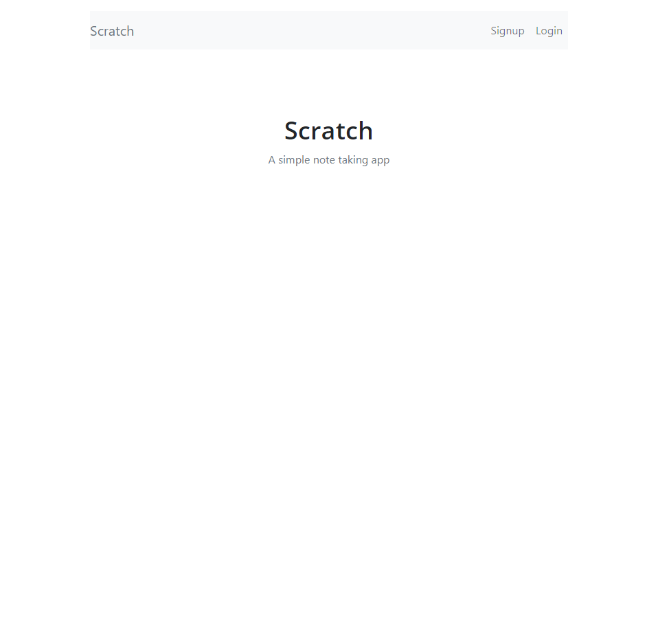
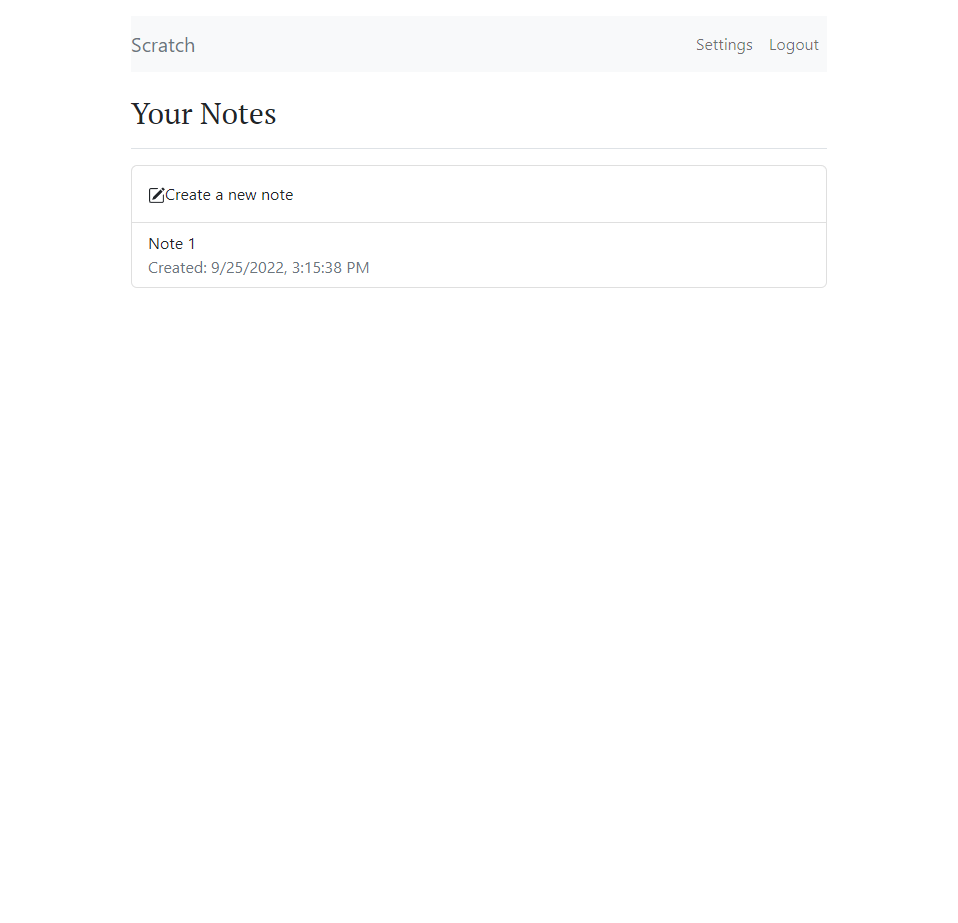
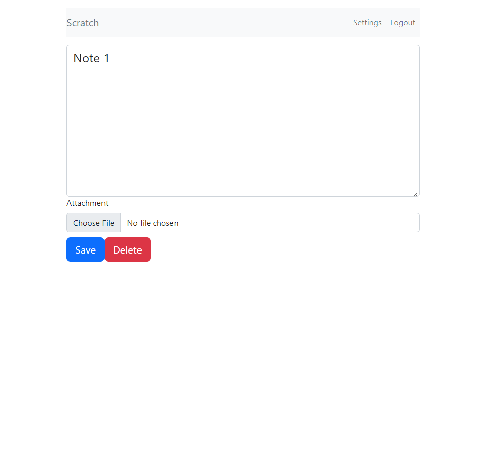

# Serverless-Stack-project
[Serverless-Stack-Guide](https://serverless-stack.com/#guide)

## Project
[code](Serverless-project)

## Demo
https://d1dtl28wyvbahi.cloudfront.net/

## Screenshots

## Features

- learn how to using modern technologies such as Lambda ,API Gateway, DynamoDB, S3.....
- Learn how to use routes in React
- Learn how to use custom domains
- Learn how to debug full-stack serverless apps
